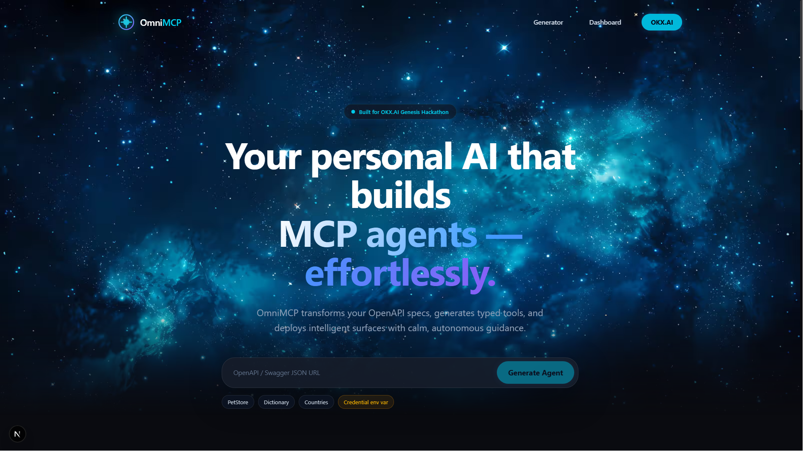

# OmniMCP — API-to-Agent Automator

*Built for the OKX.AI Genesis Hackathon* | 🏆 **Registered ASP Agent ID: #6139**

Live app: https://omnimcp.onrender.com/

Registered MCP endpoint: https://omnimcp.onrender.com/api/agents/omnimcp-generator/mcp

**OmniMCP** is an autonomous meta-agent that reads any OpenAPI/Swagger spec and instantly generates a functional MCP-style agent surface. It transforms legacy Web2 APIs into deployable Agent Service Provider (ASP) candidates for OKX.AI in under 60 seconds.



---

## 🌟 Why OmniMCP?
OKX.AI is the world's first A2A agent economy. While A2A (Agent-to-Agent) is great for complex tasks, standard API services are best suited for **A2MCP (Agent-to-MCP)** endpoints. 

OmniMCP solves the marketplace **cold-start problem**. Instead of manually writing and hosting custom integration code for every API, OmniMCP allows developers to instantly onboard thousands of existing Web2 APIs (like weather, crypto prices, dictionaries, etc.) into the Web3 agentic economy.

## ✨ Features
- **Intelligent Parsing:** Automatically fetches and normalizes OpenAPI 3.x and Swagger 2.0 specifications.
- **AI-Powered Mapping:** Uses OpenRouter (Gemini 2.5 Flash) to intelligently translate REST endpoints into semantic, descriptive MCP tool definitions that other AI agents can easily understand.
- **x402 Monetization:** Automatically wraps generated agent tools in the x402 pay-per-call protocol for seamless marketplace billing.
- **On-Chain Schema Verification:** Computes a real-time SHA-256 cryptographic hash of the agent schema for immutable verification on the X Layer.
- **Universal Proxy Engine:** Dynamically intercepts MCP tool calls, reconstructs the underlying HTTP request (mapping path, query, and body params), executes the Web2 REST call, and returns the result.
- **MCP JSON-RPC Endpoint:** Each generated agent exposes `/api/agents/[id]/mcp` with `initialize`, `tools/list`, and `tools/call` methods for agent-to-agent demos.
- **Interactive Tool Tester:** A beautiful, glassmorphic UI that automatically generates test forms based on the AI-generated JSON schema of your new tools.
- **Zero-Cost Deployment:** Uses a file-backed local agent store for the hackathon MVP, meaning it can run with a ₹0 budget and zero database setup.

## 🚀 Getting Started

### Prerequisites
- Node.js 18+
- A free [OpenRouter API Key](https://openrouter.ai/)

### Installation
1. Clone the repository:
   ```bash
   git clone https://github.com/yourusername/omnimcp.git
   cd omnimcp
   ```

2. Install dependencies:
   ```bash
   npm install
   ```

3. Configure Environment Variables:
   Copy the example environment file and add your OpenRouter API key.
   ```bash
   cp .env.example .env.local
   ```
   Open `.env.local` and set:
   ```env
   OPENROUTER_API_KEY=your_actual_api_key_here
   ```

4. Start the development server:
   ```bash
   npm run dev
   ```

5. Open [http://localhost:3000](http://localhost:3000) in your browser.

## 🛠️ Tech Stack
- **Frontend:** Next.js 16 (App Router), React, Tailwind CSS, Framer Motion
- **Backend:** Next.js Serverless API Routes
- **AI Engine:** OpenRouter API (`google/gemini-2.5-flash`)
- **Parsing:** Lightweight OpenAPI/Swagger JSON normalizer in `src/lib/openapi-parser.ts`
- **Design:** Glassmorphism, JetBrains Mono, Inter

## MCP Endpoint
Each generated agent exposes a JSON-RPC endpoint at:

```text
/api/agents/[id]/mcp
```

The registered OKX.AI demo service uses:

```text
https://omnimcp.onrender.com/api/agents/omnimcp-generator/mcp
```

Supported methods:

```json
{ "jsonrpc": "2.0", "id": 1, "method": "initialize" }
{ "jsonrpc": "2.0", "id": 2, "method": "tools/list" }
{ "jsonrpc": "2.0", "id": 3, "method": "tools/call", "params": { "name": "generate_mcp_agent", "arguments": { "specUrl": "https://api.weather.com/openapi.json" } } }
```

## API Credentials
For APIs that require credentials, OmniMCP stores an environment variable name instead of storing the secret value. Add the secret to your server environment, then use the credential field in the generator:

```env
WEATHER_API_KEY=your_real_secret
```

API key auth can be injected as a header or query parameter. Bearer auth uses `Authorization: Bearer <token>`. Basic auth expects the env var value to be `username:password`.

## 💡 Hackathon Demo Note
To guarantee a flawless live presentation without relying on flaky free-tier AI APIs during high-traffic spikes, the application includes a **"Demo Safe Mode"**. If the Gemini API experiences a `503 High Demand` or `429 Quota` error, OmniMCP will seamlessly intercept the error and return pre-computed configurations for the demo APIs (PetStore and Dictionary). 

## 📜 License
MIT License
